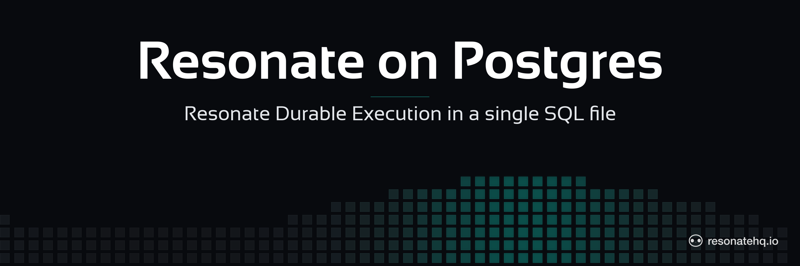

<p align="center">
  <picture>
    <source media="(prefers-color-scheme: dark)" srcset="./assets/banner-dark.png">
    <source media="(prefers-color-scheme: light)" srcset="./assets/banner-light.png">
    
  </picture>
</p>

# Resonate on Postgres

[](https://opensource.org/licenses/Apache-2.0)

## About this component

**Dead simple durable execution.**

Resonate durable execution runs your code as a reliable workflow, checkpointing each step as a durable promise, sleeping for days, surviving crashes and restarts. resonate-pg is one SQL file. No additional servers, queues, or timers — Postgres, with pg_cron, is all three. Full docs for this provider live at [docs.resonatehq.io/deploy/providers/postgres](https://docs.resonatehq.io/deploy/providers/postgres).

```ts
resonate.register(
  "countdown",
  async function countdown(ctx: Context, n: number) {
    for (let i = n; i > 0; i--) {
      await ctx.run(() => console.log(`countdown: ${i}`));
      await ctx.sleep(10 * 60 * 1000); // durable: no process waits
    }
    await ctx.run(() => console.log("liftoff 🚀"));
  },
);
``` 

Crash the process, redeploy, or lose the machine mid-run — the workflow resumes on the right number, and nothing runs twice. Each `ctx.run` is checkpointed to Postgres as it completes, so a resumed run replays finished steps from the database instead of re-executing them. And `ctx.sleep` is just a row with a deadline: the invocation returns and nothing runs until it fires, whether that's ten minutes or ten days from now.

> **On Supabase?** [`example/countdown`](example/countdown) goes from an empty project to a running durable workflow in about five minutes.

- [Read the docs for this provider](https://docs.resonatehq.io/deploy/providers/postgres)
- [Evaluate Resonate for your next project](https://docs.resonatehq.io/evaluate/)
- [Example application library](https://github.com/resonatehq-examples)
- [Distributed Async Await — the concepts that power Resonate](https://www.distributed-async-await.io/)
- [Join the Discord](https://resonatehq.io/discord)
- [Subscribe to the Journal](https://journal.resonatehq.io/subscribe)
- [Follow on X](https://x.com/resonatehqio)
- [Follow on LinkedIn](https://www.linkedin.com/company/resonatehqio)
- [Subscribe on YouTube](https://www.youtube.com/@resonatehqio)

<p align="center">
  <picture>
    <source media="(prefers-color-scheme: dark)" srcset="./assets/quickstart-banner-dark.png">
    <source media="(prefers-color-scheme: light)" srcset="./assets/quickstart-banner-light.png">
    
  </picture>
</p>

## Requirements

- Postgres 16+
- `pg_cron` — required; it drives all timers
- `pg_net` or `pgsql_http` — optional; either one enables HTTP push delivery

## Install

resonate-pg is a Resonate server in a single file. Apply it to a database:

```bash
psql -d yourdb -f resonate.sql
```

There is no binary to run and no process to supervise. Postgres is the server.

## Connecting workers

Every protocol action is a stored function, reached through the `resonate_rpc` dispatcher rather than an HTTP URL:

```sql
SELECT resonate.resonate_rpc('{"kind":"promise.get","head":{},"data":{"id":"invoke:foo"}}');
```

So a worker needs a client that speaks to that function over a Postgres connection. The path demonstrated in this repository is the Supabase TypeScript client:

```typescript
import { type Context, Resonate } from "jsr:@resonatehq/supabase@0.4.1";

const resonate = new Resonate();
```

Both examples under [`example/`](example) use it. See [`example/countdown`](example/countdown) for a full deployment, empty project to running workflow.

Despite the name, `@resonatehq/supabase` is a Postgres client rather than a Supabase-only one. It is pre-1.0; expect its surface to move.

**Other languages.** There is no `resonate_rpc` client in the Python, Go, Rust, or Java SDKs, so teams on those languages can't use this provider today. `test/conformance.py` shows the shape one would take — an HTTP interface in front of `resonate_rpc` — but it exists to drive the conformance harness and is not a shipped client.

Applying `resonate.sql` creates a `resonate_worker` role and revokes `EXECUTE` from `PUBLIC`, so grant it to whatever role your worker connects as:

```sql
GRANT resonate_worker TO myworker;
```

## Operations

Completed workflows stay in the database. Delete old ones on a schedule:

```sql
-- daily at 03:00: delete workflows finished more than 7 days ago
select cron.schedule('resonate-gc', '0 3 * * *',
  $$select resonate.gc((extract(epoch from now())*1000 - 7*86400000)::bigint)$$);
```

`resonate.gc` deletes at most 10,000 rows per call unless you pass a higher limit as a second argument, so check it keeps up with your volume.

**Garbage collection deletes your idempotency guarantee.** Workflow ids dedupe only while their row exists, so a horizon shorter than your retry window turns a duplicate submission into a second execution. Keep it longer than any window in which you might re-send the same id.

## Under the hood

resonate-pg is a faithful implementation of the Resonate protocol. Every protocol action is a stored function; `resonate_rpc` is the wire dispatcher in front of them, and `pg_cron` fires the timers.

## What's not there yet

Read this before you plan a production rollout.

- **Open correctness issues in the task lifecycle.** The tracker carries confirmed bugs — a task that can be halted after it reports fulfilled, a lease claimed by `task.create` that `task.acquire` then refuses as timed out, timeout handlers redispatching workflows that are already finished, and a settlement cascade that can wake an awaiter whose own promise is already dead. Read the [open issues](https://github.com/resonatehq/resonate-pg/issues) before you commit to this provider.
- **TypeScript only.** No other SDK has a client that can reach `resonate_rpc`.
- **The worker client is pre-1.0.** `@resonatehq/supabase` has not reached a stable release.
- **Timers depend entirely on `pg_cron`.** There is no in-database fallback. If the cron job is unscheduled, paused, or lost in a restore, durable sleeps stop waking and nothing surfaces the failure.
- **Retention is yours to run.** See [Operations](#operations) — completed workflows stay until you delete them, and the horizon interacts with idempotency.
- **No horizontal story beyond Postgres's own.** Throughput, connection limits, and failover are whatever your Postgres deployment provides. There is nothing to scale independently of the database.
- **No production reference deployments.** Nobody is running this in production yet.
- **No CI.** The conformance shim exists but nothing runs it on push or pull request.

## How it's tested

`test/conformance.py` is a shim that puts an HTTP interface in front of `resonate_rpc`, so the external Resonate conformance harness can drive a resonate-pg database as if it were a Resonate server. It needs `psycopg`:

```bash
pip install 'psycopg[binary,pool]'
DATABASE_URL=postgres://... python test/conformance.py
```

The harness then runs against `RESONATE_URL=http://localhost:8001`.

There is no CI workflow on this repository, so nothing runs this on push or pull request.

## Community

Questions, ideas, or want to help? Open an issue or a pull request — contributions welcome. resonate-pg is part of [Resonate](https://github.com/resonatehq/resonate).

- [Discord](https://resonatehq.io/discord)
- [X](https://x.com/resonatehqio)
- [LinkedIn](https://www.linkedin.com/company/resonatehqio)
- [YouTube](https://www.youtube.com/@resonatehqio)
- [Journal](https://journal.resonatehq.io)

## License

[Apache 2.0](./LICENSE).
