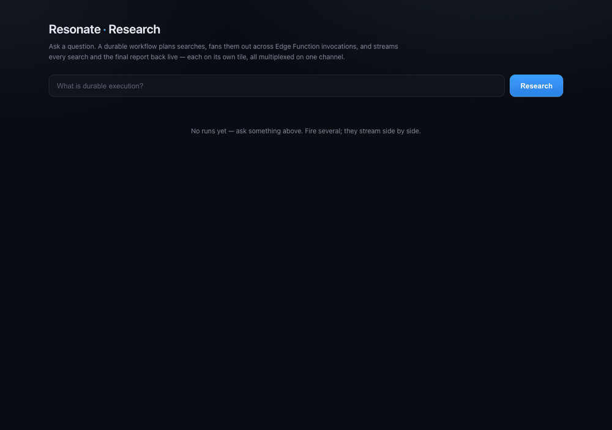

<picture>
  <source media="(prefers-color-scheme: dark)" srcset="../../assets/resonate-banner.png">
  
</picture>

# Research on Supabase

A durable research agent that **streams to the browser in real time**. Ask a question: a durable workflow plans web searches and fans them out, each on its own Edge Function invocation, all in parallel. Every search *and* the final report stream back live, each on its own tile. While the searches run the workflow suspends, then resumes to write the report. Every step is checkpointed.



The streaming is a tiny protocol multiplexed on **one** Supabase Realtime channel: the root workflow's origin (`context.originId`). Every message carries the **promise id** it belongs to, framed with begin/end markers, so one channel can carry many concurrent streams and the page demuxes them into tiles.

Full worker: [`index.ts`](index.ts). Frontend: [`page.ts`](page.ts).

## 1. Create the project

```bash
supabase projects create resonate-research
```

The command prompts for your org, region, and a database password, then prints the project **ref** used below.

## 2. Install the server

Link the project once, then apply the extensions and `resonate.sql`. Every step runs over the Management API, no connection string needed:

```bash
supabase link --project-ref <project-ref>
supabase db query --linked "create extension if not exists pg_cron; create extension if not exists pg_net;"
supabase db query --linked -f resonate.sql
```

## 3. Deploy the function

```bash
mkdir -p supabase/functions/research && cp example/research/index.ts supabase/functions/research/index.ts
supabase functions deploy research --no-verify-jwt
```

## 4. Add your Anthropic key

```bash
supabase secrets set ANTHROPIC_API_KEY=sk-ant-...
```

## 5. Run the UI

Supabase Edge Functions can't serve HTML (the platform forces `text/plain`), so [`page.ts`](page.ts) is a tiny local host that serves the page and starts runs. It still talks to the **real** remote Supabase for Realtime and to the deployed `research` worker:

```bash
SUPABASE_URL=https://<project-ref>.supabase.co \
SUPABASE_ANON_KEY=<anon key> \
RESEARCH_URL=https://<project-ref>.functions.supabase.co/research \
DATABASE_URL='postgres://postgres.<project-ref>:<db-password>@aws-0-<region>.pooler.supabase.com:5432/postgres?sslmode=require' \
  deno run -A example/research/page.ts
```

Open **http://localhost:8890**, ask a question, and watch the tiles stream: searches fill in parallel, then the report.

## 6. Cleanup

```bash
supabase projects delete <project-ref>
```
